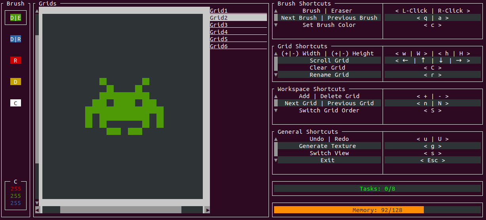
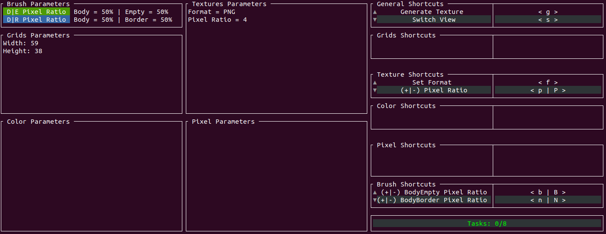
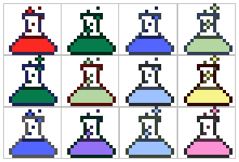
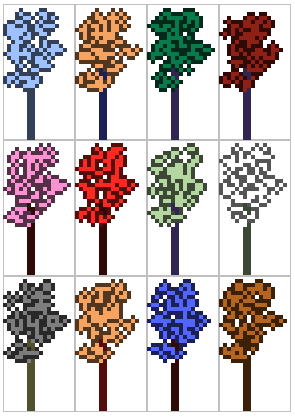

# Liriodendron

<div align="center">

Procedural Pixellized 2D Textures Generator with TUI in Rust

Edit View:


Parametric View:


1 grid generations:</br>


2 grids generations:</br>


</div>

## Installation

### Prebuilt binaries

Prebuilt binaries are provided in the [releases](https://github.com/pabtomas/liriodendron/releases) tab.

### From source

```bash
cargo install liriodendron
```

## CLI Options

```
USAGE:
    liriodendron [FLAGS] [OPTIONS]

FLAGS:
    -h, --help             Prints help information
    -u, --userinterface    Uses terminal to edit grids and generate textures
    -V, --version          Prints version information

OPTIONS:
    -a, --max-actions <max-actions>                Set the maximum number of saved actions in the log [default: 8]
    -c, --max-filled-cells <max-filled-cells>      Set the maximum number of brushed cells on the grids [default: 7]
    -w, --max-waiting-tasks <max-waiting-tasks>    Set the maximum number of possible waiting tasks [default: 2]
    -t, --threads-number <threads-number>          Set the maximum number of running tasks threads [default: 4]
```

## Features

 - Editable Grid
 - Several Brush action: Body Pixel, Border Pixel, Body-Border pixel, Body-Empty pixel and Specific Color pixel.
 - Eraser
 - Clear Grid shortcut
 - Specific Color Pixel Setter
 - Generation Number Setter
 - Grid Size Setters
 - Multi-threaded textures generation
 - Textures generation waiting queue
 - Customizable ratio for Body-Empty and Body-Border pixel
 - Undo/Redo shortcut
 - Customizable texture format
 - Customizable Pixels-Cell ratio
 - Add/Delete Grid shortcuts
 - Switch grid tab shortcut
 - Switch grid order shortcut
 - Rename Grid shortcut
