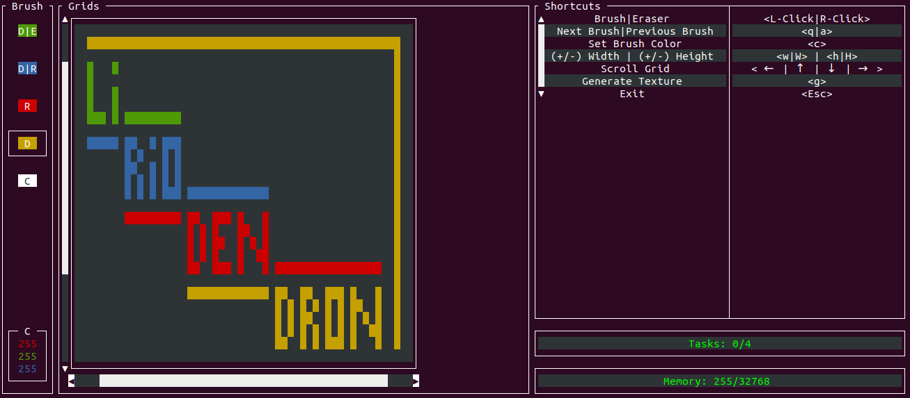

# Liriodendron

<div align="center">

A Procedural Pixellized 2D Textures Generator in Rust



</div>

## Installation

Prebuilt binaries are provided in the [releases](https://github.com/pabtomas/liriodendron/releases) tab.

## CLI Options

```
USAGE:
    liriodendron [FLAGS]

FLAGS:
    -h, --help             Prints help information
    -u, --userinterface    Uses terminal to edit grids and generate textures
    -V, --version          Prints version information
```

## Features

 - Editable Grid
 - Body Pixel Brush action
 - Border Pixel Brush action
 - Body-Border Pixel Brush action
 - Bordy-Empty Pixel Brush action
 - Specific Color Pixel Brush action
 - Eraser
 - Specific Color Pixel Setter
 - Generation Number Setter
 - Grid Size Setters
 - Multi-threaded textures generation
 - Textures generation waiting queue
